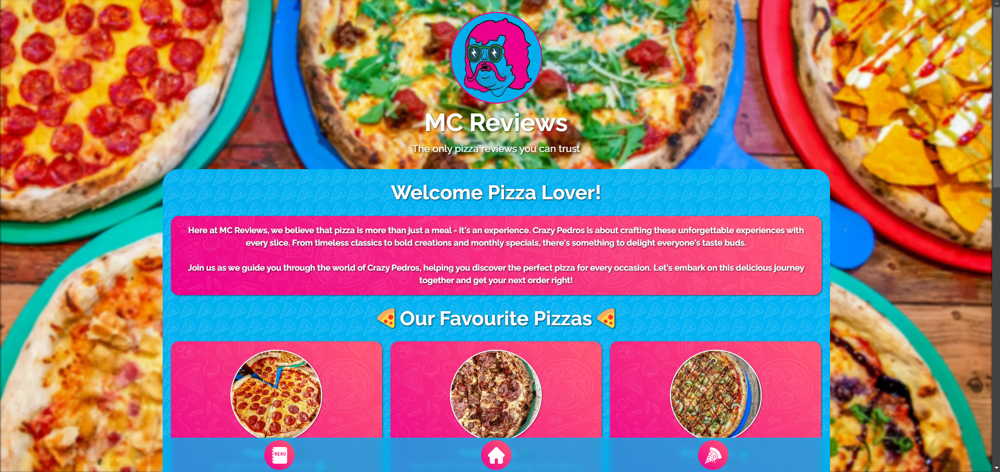
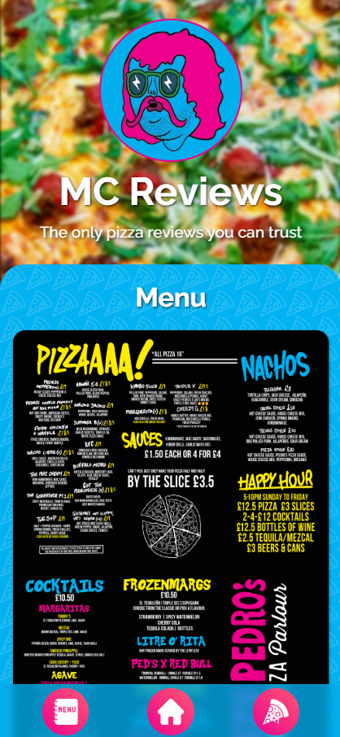

# MC Pizza Reviews

The application is deployed on Vercel and can be viewed [here](https://mc-reviews-ebon.vercel.app/)

## About the project

This application allows users to rate and review pizzas from Crazy Pedros. It was created as a fun project to track our favourite pizzas as we are frequent customers.

#### Features

- User Reviews: Upload and edit reviews and ratings for different pizzas.
- Image Uploads: Easily upload images of your pizza using the Cloudinary API, with images stored and accessed seamlessly via the website.
- Mobile-First Design: The site is optimized for mobile devices, ensuring a seamless experience on phone displays.
- Animations: Enhanced user experience using Framer-motion throughout the site.
- Instagram widget: View the latest Instagram posts from Crazy Pedros.

<p align="center">
  
  
  
  
</p>

## Setup

#### Dependencies

- [Cloudinary](https://cloudinary.com/)
- [Framer Motion](https://www.framer.com/motion/introduction/)

#### Getting started

This is a [Next.js](https://nextjs.org/) project bootstrapped with [`create-next-app`](https://github.com/vercel/next.js/tree/canary/packages/create-next-app).

First, run the development server:

```bash
npm run dev
# or
yarn dev
# or
pnpm dev
# or
bun dev
```

Open [http://localhost:3000](http://localhost:3000) with your browser to see the result.

You can start editing the page by modifying `app/page.js`. The page auto-updates as you edit the file.

This project uses [`next/font`](https://nextjs.org/docs/basic-features/font-optimization) to automatically optimize and load Inter, a custom Google Font.

## References

- [Cloudinary](https://cloudinary.com/)
- [Crazy Pedros](https://crazypedros.co.uk/)
- [Google fonts](https://fonts.google.com/)
- [Instagram widget](https://elfsight.com/)
